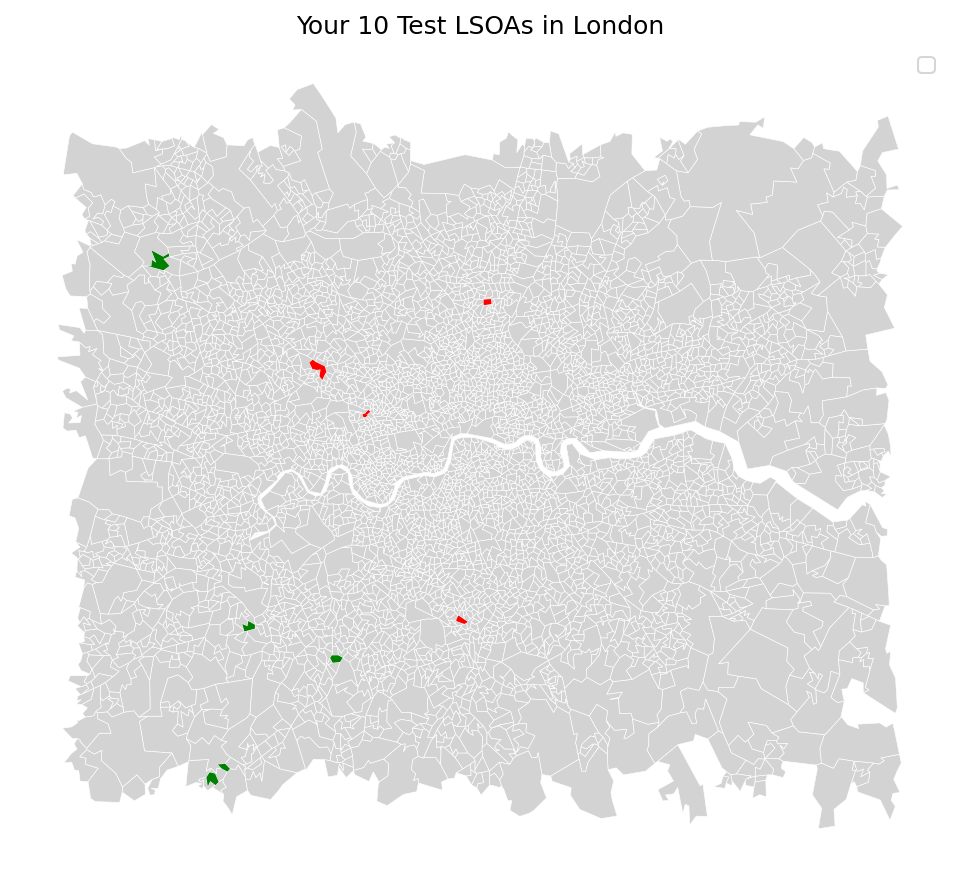

# Urban Inequality Fingerprints

### Predicting Neighbourhood Deprivation from Street-Level Imagery using Computer Vision

## Overview

This project uses a fine-tuned ResNet-18 convolutional neural network to predict
neighbourhood deprivation scores from Google Street View imagery across London.
By combining computer vision, geospatial analysis, and explainable AI, it identifies
visual markers of socioeconomic inequality at street level.

The model achieves an R² of 0.942 on validation data, explaining 94% of the variance
in deprivation rankings from street imagery alone.

## Key Results

- **R² of 0.942** on validation set
- **1,708 Street View images** across 500 London neighbourhoods
- **GradCAM explainability** revealing that the model focuses on building facades,
  vegetation, and sky visibility as key deprivation indicators
- **Interactive choropleth map** of predicted deprivation across London

## Visual Outputs

### GradCAM Explainability

### London Deprivation Map

## Tech Stack

- **Python** — PyTorch, GeoPandas, Folium, Scikit-learn
- **Computer Vision** — ResNet-18 pretrained on ImageNet, fine-tuned for regression
- **Explainability** — GradCAM (Gradient-weighted Class Activation Mapping)
- **Geospatial** — GeoPandas, Folium interactive maps
- **Data** — UK Government IMD 2019, Google Street View Static API

## Data Sources

- [Index of Multiple Deprivation 2019](https://www.gov.uk/government/statistics/english-indices-of-deprivation-2019) — UK Government
- [LSOA Boundaries](https://geoportal.statistics.gov.uk) — Office for National Statistics
- Google Street View Static API

## How It Works

1. Sample 500 London LSOAs stratified across deprivation deciles
2. Download 4 Street View images per LSOA (N/S/E/W headings)
3. Fine-tune ResNet-18 to predict normalised IMD rank from imagery
4. Apply GradCAM to visualise which parts of street scenes the model focuses on
5. Plot predictions on an interactive Folium map

## How to Run

1. Clone this repository
2. Install dependencies: `pip install -r requirements.txt`
3. Copy `src/api_keys_template.py` to `src/api_keys.py` and add your Google API key
4. Run notebooks in order: `notebook1` through `notebook5`

## Key Finding

Even with a relatively small training set, the model identifies **sky visibility,
vegetation presence, and building scale** as primary visual predictors of neighbourhood
deprivation — consistent with urban planning literature on green space inequality
and housing density.

## Author

Built as a portfolio project demonstrating computer vision, geospatial analysis,
and explainable AI applied to a real-world social impact problem.
